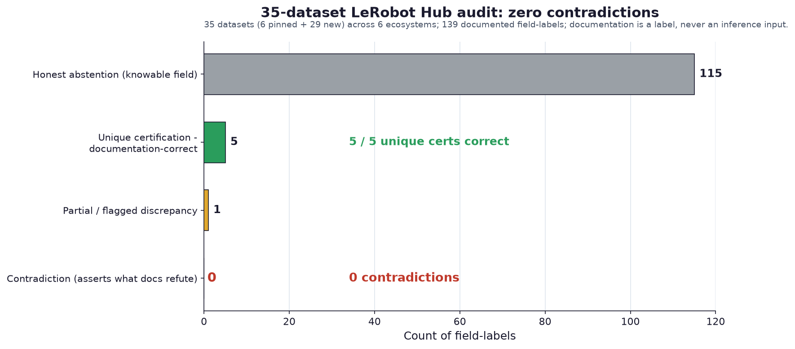

# ActionABI

> **A robot's action tensor is a vector of numbers with an undocumented meaning. Given only logged
> trajectories, can you recover what those numbers mean — and honestly say "I can't" when the data
> doesn't tell you?**

ActionABI is an evidence-first C++20 audit tool for **forensic recovery of undocumented robot
action-tensor contracts**. Given provenance-preserving trajectories and a finite set of candidate
contracts, it scores candidates on held-out episodes, **retains a calibrated equivalence set instead
of breaking ties**, proposes bounded separating probes, and emits a converter **only when every
required field is supported** by an evidence report. Its defining discipline is **calibrated
abstention**: it never certifies a unique answer the data does not support.

![ActionABI recovering a hidden action contract from a real ManiSkill bridge trace: as held-out evidence accumulates the per-channel resolution meters update (target resolves to 100%, permutation and sign stay constrained, scale and lag stay ambiguous, gripper and frame are structurally unobservable), the equivalence set holds at 56 observationally-equivalent contracts with the true contract retained, and ActionABI issues an honest abstention rather than certify a unique contract the data cannot support.](media/recovery_demo.gif)

*Real ActionABI output on a real ManiSkill bridge trace (`c029_policy`): the animation replays the tool's
own C++ held-out Huber residuals (Python parity-gated at 5e-17) as evidence accumulates over the trace.
The `target` channel resolves, but the joint contract never collapses to a unique answer — 56 contracts
remain observationally equivalent (the true one retained) — so ActionABI **abstains** and emits no
converter. High per-channel confidence is not a unique joint contract. Regenerate with
`python media/make_media.py`.*


*Evidence in, a verified converter or an honest refusal out. The equivalence set is the heart of the
tool: when two contracts fit the data equally well, ActionABI keeps both and abstains, rather than
picking one and certifying a lie.*

## Part of the Action-Interface pair

ActionABI is one half of a two-project attack on the **hidden action-interface contract** problem —
when the meaning of a robot's action numbers is undocumented or silently changed. ActionABI is the
*offline forensic* half: given only logged trajectories it recovers an action-interface contract after
the fact, retains a calibrated equivalence set, and abstains when the evidence is insufficient. Its
sibling, [**ActionShift**](https://github.com/Archerkattri/actionshift), is the *online adaptation*
half: a benchmark that measures whether a policy can recover the same hidden contract on its own, in the
loop, from a handful of bounded probes. The two share one **contract grammar** (permutation · sign ·
scale · target · frame · lag · gripper), and the coupling is real code, not just a theme: **this
project's C++ evidence scorer runs as a live backend inside ActionShift's belief loop** via a pybind11
fusion module, with verified numerical parity (see ActionShift's
[`reports/cpp_fusion.md`](https://github.com/Archerkattri/actionshift/blob/main/reports/cpp_fusion.md)).
Forensic recovery ↔ online adaptation, one shared grammar, one shared scorer.
→ **[ActionABI](https://github.com/Archerkattri/actionabi)** ·
**[ActionShift](https://github.com/Archerkattri/actionshift)**

## Contents

- [What is this?](#what-is-this)
- [Who is this for?](#who-is-this-for)
- [How it works](#how-it-works)
- [How it performed (evidence summary)](#how-it-performed-evidence-summary)
- [Build and run](#build-and-run)
- [Python bindings (pybind11 fusion backend)](#python-bindings-pybind11-fusion-backend)
- [Results index (frozen real-data matrix)](#results-index-frozen-real-data-matrix)
- [Claims (graded SOTA ledger)](#claims-graded-sota-ledger)
- [Reproducing](#reproducing)
- [Report index](#report-index)
- [Related work & positioning](#related-work--positioning)
- [Honest limits](#honest-limits)
- [Competitive boundary](#competitive-boundary)
- [License, citation, and data](#license-citation-and-data)

## What is this?

When a robot policy is trained on one dataset and run on another robot — or when a dataset is published
without a complete spec — the *meaning* of the action tensor is often missing: is the third channel a
delta or an absolute target? Is the gripper `1 = open` or `1 = close`? Which channel drives which joint,
with what sign, gain, frame, and latency? Guessing wrong does not throw an error; it moves a real robot
the wrong way. ActionABI treats that undocumented **action contract** as a *forensic inference target*
over the trajectories themselves — the logged state and action streams — and recovers what the evidence
supports while refusing to invent what it does not.

Concretely, ActionABI scores a finite declared grammar of candidate contracts on held-out episodes,
groups observationally-equivalent candidates into a **calibrated equivalence set**, and only emits an
action converter when every field the converter needs is forced by the evidence. When the data is
under-determined — a stationary axis, a passive log with no frame information, a saturating controller
that hides scale — it **abstains** and says so, field by field.

The supported claim is deliberately narrow. ActionABI can distinguish *some* members of its declared
finite grammar when the recorded trajectories carry enough excitation and observability. It does not
recover arbitrary controllers, certify a universal action interface, infer semantics absent from the
sensors, or make a robot-safe probe without device-specific bounds. The CUDA backend is
**experimental** because it failed the preregistered transfer-inclusive 5× performance gate.

## Who is this for?

- **Dataset maintainers and robot-learning practitioners** who inherit trajectories with missing or
  untrusted action-space metadata and need to know, honestly, which convention fields are recoverable
  from the data and which are not — before a policy is trained or transferred on a wrong assumption.
- **Anyone deploying a policy across robot stacks** where the action contract may silently differ.
  ActionABI is the data-side complement to [ActionShift](../actionshift/README.md), which studies the
  same hidden-contract problem from the *policy adaptation* side; ActionABI's C++ scoring core is in fact
  [load-bearing inside ActionShift's belief loop](#python-bindings-pybind11-fusion-backend).
- **Robotics-systems and safety engineers** who want a converter that comes with an evidence report and a
  refusal gate, not a best-guess mapping — because a wrong action-semantics guess moves a real robot.

Real robot-learning ecosystems already disagree on these conventions in practice — which is exactly why
the problem is not invented. See the [gripper-polarity disagreement](#how-it-performed-evidence-summary)
between two actively-used dataset families below.

## How it works

**The finite declared grammar** covers:

- **target** — absolute position, delta position, or velocity;
- **space** — joint or Cartesian;
- **frame** — world / base / tool;
- **permutation** of channels; per-channel **sign**; per-channel positive **scale**;
- nonnegative integer **lag** (a command that lands `lag` steps late);
- **gripper inversion**.

`schemas/action_spec.schema.json` defines the JSON boundary. Canonical JSONL input starts with one
metadata record (source filename, SHA-256, extraction date, state columns, units), followed by sample
records with `episode_id`, `t_ns`, `state`, and `action`. Unsupported or ambiguous fields stay explicit:
fixed resets can preserve absolute/episode-relative equivalence; stationary or correlated axes can
preserve sign/permutation equivalence; passive logs may lack frame, lag, gripper, or controller
evidence; Cartesian evidence needs an opt-in URDF/Pinocchio build and never runs IK to force an answer.

**The pipeline** (see the diagram at the top) scores each candidate contract's per-channel evidence on
held-out episodes, folds observationally-equivalent candidates into a calibrated equivalence set, and
then branches: if the evidence forces a unique contract with every required field supported, it emits a
converter; otherwise it abstains and emits a refusal with a field-by-field evidence report. Documentation,
when present, is used only as a *label to score recovered conventions against* — never as an inference
input.

## How it performed (evidence summary)

Every number below is committed under `results/` (raw) and written up in `reports/` (analysis).

**Calibrated abstention eliminates false uniques.** On a 100-case synthetic ambiguity gate with 25
deliberately observationally-equivalent cases, a naive forced-argmin baseline turns all 25 into false
unique certifications; ActionABI abstains on exactly those 25 and produces **zero** false uniques while
retaining full coverage. The same calibration property holds on the labeled-simulation bridge, where a
bias-robustness fix drove false uniques from 4 to 0 and lifted truth equivalence-set coverage 0.02 → 0.39.


### Synthetic falsification — abstention eliminates false uniques (`reports/benchmark_sprint.md`)

100 finite-grammar cases, 25 deliberately observationally-equivalent (zero excitation), seed `20260718`.
Documentation is never an inference input.

| Method | Field accuracy (target / lag) | Equivalence coverage | **False unique** | Abstention |
|---|---:|---:|---:|---:|
| Forced residual argmin | 0.82 / 0.82 | 1.00 | **25** | 0.00 |
| **ActionABI calibrated set** | 1.00 / 1.00 | 1.00 | **0** | 0.25 |

Forced argmin turns all 25 constructed equivalence cases into false unique certifications; ActionABI
abstains on exactly those 25 and produces **zero** false uniques while retaining full coverage.

### Labeled-simulation supervised accuracy (`reports/labeled_sim_traces.md`, `reports/scorer_fixes.md`)

First supervised measurement against **ground-truth latent contracts** recovered from real GPU simulation
dynamics (ManiSkill PickCube-v1, `pd_ee_delta_pose`), 90 traces over 45 hash-disjoint contracts. Labels
are written to a separate file and are never an inference input.

Forced-argmin per-field accuracy, **pre-fix → post-fix** (measurement-driven hardening, same 90 traces):

| Field (overall) | permutation | sign | scale | target | lag |
|---|---:|---:|---:|---:|---:|
| pre-fix | 0.63 | 0.76 | 0.24 | 0.74 | 0.39 |
| **post-fix** | **0.80** | **0.84** | **0.31** | 0.74 | **0.66** |

Structural fields are identifiable: permutation/sign reach **0.92 / 0.93** at lag 0 and **0.97 / 0.98**
under random excitation. Calibrated ActionABI vs. forced argmin, pre-fix → post-fix: **false unique
certifications 4 → 0**, truth equivalence-set coverage **0.02 → 0.39**, abstention 0.96 → 1.00. Scale
stays low (~0.6× systematic under-tracking) — a controller/response-model confound, not a grammar limit.
The measurement surfaced two real ActionABI defects (below), now fixed.

### 35-dataset LeRobot Hub audit — zero contradictions (`reports/lerobot_hub_audit.md`)

ActionABI pointed at **35 in-the-wild LeRobot datasets** (6 pinned + 29 new) across six ecosystems,
scoring recovered conventions against documented ones (documentation is a **label only**, never an
inference input). Over **139 documented field-labels**:

| Metric | Value |
|---|---:|
| Contradictions (ActionABI asserts what documentation refutes) | **0 / 139** |
| Unique field certifications | 5 |
| — documentation-correct | **5 / 5** |
| — false unique certifications | **0** |
| Abstention-consistent (honest abstention on a knowable field) | 115 |

Every abstention lands on a field documentation confirms was in principle knowable — honest, not vacuous.
The narrower six-dataset baseline (27 labels, 0 contradictions) is in `reports/documentation_agreement.md`.



**The premise is real, not invented: robot ecosystems actively disagree on action conventions.** The
audit surfaced at least five distinct documented gripper conventions across dataset families — most
starkly, ALOHA documents `0 = closed / 1 = open` while Open X-Embodiment documents
`1 = close / −1 = open / 0 = no-change`. The same numeric channel carries the opposite physical meaning
across two actively-used dataset families — independent evidence that action semantics silently vary.


### Three defects found and fixed as measurement-driven hardening

Each was surfaced by a measurement above, root-caused, fixed, and guarded by a regression test:

1. **Lag observable spanned `lag+1` steps** instead of a single delayed step (`src/score_cpu.cpp`,
   `cuda/score_cuda.cu`). Fixed to `state[row+lag+1] - state[row+lag]`; now matches the Python reference
   scorer for every lag (C++/Python residual parity max gap `2.8e-16`). Regression test in
   `tests/test_score.cpp` reproduces the old bug (fails on the span, passes on the fix). lag>0 accuracy
   improves sharply post-fix (e.g. lag=2 permutation 0.49→0.89, lag recovery 0.25→0.88); an honest
   counter-movement at lag=0 (permutation 0.92→0.72) is reported alongside, not hidden.
2. **Calibration was not robust to systematic response bias** (`experiments/bias_robust.py`). A
   fail-closed guard estimates a systematic-bias bound from the argmin's held-out residual structure and
   abstains under detected misspecification. Drove labeled-sim false uniques 4 → 0; no-op on zero-mean
   noise, so the synthetic matrix is unchanged. 8 new tests in `experiments/test_bias_robust.py`.
3. **Gate false-equivalence bug** (`experiments/real_dataset_gate.py`): a near-static reset trajectory
   made absolute ~ episode-relative fit each other, certifying a 2-way set that *excluded* the
   strictly-better delta (one contradiction on `berkeley_rpt`). Fixed to require the best-fit target in the
   equivalence branch; all 6 pinned outcomes preserved. Regression test
   `test_delta_control_with_fixed_resets_is_not_false_equivalence`.

Full verification ledger: 8/8 CTests (Release), 8/8 under ASan/UBSan, CUDA parity pass, 32/32 Python
tests — `reports/scorer_fixes.md`.

## Build and run

The project requires **CMake 3.26+**, a C++20 compiler, and Python 3.11+. The host `/usr/bin/cmake` may
be too old; a pinned modern CMake via `uvx` is the reference recipe:

```bash
uvx --from cmake cmake -S . -B build -DACTIONABI_BUILD_TESTS=ON -DCMAKE_BUILD_TYPE=Release
uvx --from cmake cmake --build build -j 8
uvx --from cmake ctest --test-dir build --output-on-failure
./build/actionabi --version
./build/actionabi infer \
  --input tests/fixtures/simple.jsonl \
  --contract tests/fixtures/absolute.json \
  --contract tests/fixtures/delta.json \
  --output build/evidence.json
```

The `infer` CLI scores supplied contracts; it does not silently expand an unbounded search. Python
adapters and experiments use the pinned packages in `requirements-experiments.txt`.

**Test fixtures.** Only synthetic, redistributable trajectories belong in `tests/fixtures/`; each records
its generator seed, expected contract equivalence set, state-column semantics, units, and source hash.
Real LeRobot shards remain outside git. `simple.jsonl` is a hand-auditable one-axis absolute-position
trace (deterministic values); its expected minimum is `absolute.json`, with `delta.json` as a deliberately
worse comparison. The embedded source hash is a synthetic provenance sentinel, not a hash of private data.

### Optional backends (all OFF by default, see `cmake/ActionABIOptions.cmake`)

| Option | Effect |
|---|---|
| `-DACTIONABI_ENABLE_CUDA=ON` | Batched CUDA trajectory scorer with parity tests (experimental). |
| `-DACTIONABI_ENABLE_PINOCCHIO=ON` | URDF/Pinocchio Cartesian evidence backend. |
| `-DACTIONABI_BUILD_BENCHMARKS=ON` | `score_benchmark` scaling harness. |
| `-DACTIONABI_BUILD_PYBIND=ON` | The pybind11 fusion backend (see below). |

For any CUDA target on an RTX 5090, add `-DCMAKE_CUDA_ARCHITECTURES=120`.

**CUDA backend benchmark (failed 5× gate; CUDA remains experimental).** CPU: AMD Ryzen Threadripper PRO
7975WX 32-Cores; GPU: NVIDIA GeForce RTX 5090; Compiler GNU 12.3.0; Release; hardware concurrency 64.
Gate: transfer-inclusive CUDA median must be ≥ 5× faster than multicore CPU.

| Hypotheses | Residual evaluations | Single CPU ms | Multicore CPU ms | CUDA total ms | CUDA kernel ms | Speedup |
|---:|---:|---:|---:|---:|---:|---:|
| 128 | 10001408 | 88.370 | 4.358 | 6.157 | 5.301 | 0.71× |
| 1024 | 10010624 | 87.322 | 4.105 | 2.963 | 2.376 | 1.39× |
| 8192 | 10092544 | 89.176 | 4.377 | 2.338 | 1.149 | 1.87× |
| 65536 | 11010048 | 93.776 | 6.571 | 10.170 | 0.470 | 0.65× |

## Python bindings (pybind11 fusion backend)

`bindings/` builds ActionABI's evidence-scoring core as a Python extension, `actionabi_cells`, used as a
**live identification backend inside ActionShift's factorized-grammar Bayesian belief loop**. It computes
exactly the per-cell Gaussian log-evidence and pooled per-hypothesis log-likelihood ActionShift otherwise
computes in torch — but as a single fused C++ pass with no intermediate tensors, using the FIXED
single-step-delayed lag semantics from `reports/scorer_fixes.md` (defect 1).

| File | Purpose |
|---|---|
| `bindings/cell_score.hpp` | Header-only fused scoring core (`score_cells`, `score_hypotheses`), f32/f64. |
| `bindings/module.cpp` | pybind11 module definition and shape validation. |
| `bindings/cell_score_cuda.cu` | Optional transfer-inclusive CUDA path for `score_cells`. |

**Build.** Enable with `-DACTIONABI_BUILD_PYBIND=ON` (OFF by default). pybind11 is discovered via its
installed CMake config, or fetched at `v2.13.6` as a fallback.

```bash
uvx --from cmake cmake -S . -B build-pybind -DACTIONABI_BUILD_PYBIND=ON -DCMAKE_BUILD_TYPE=Release
uvx --from cmake cmake --build build-pybind -j 8
# -> build-pybind/actionabi_cells*.so
python -c "import sys; sys.path.insert(0,'build-pybind'); import actionabi_cells as a; print(a.has_cuda)"
```

**Optional CUDA path.** Add `-DACTIONABI_CELLS_ENABLE_CUDA=ON`. On an RTX 5090 also pass
`-DCMAKE_CUDA_ARCHITECTURES=120` (the CMake default for this target is already `120` when unset). The
CUDA path is transfer-inclusive by construction — the host entry point uploads every input, launches one
thread per output cell, and downloads the result — so reported latency is honest end-to-end. When built,
the module exposes `score_cells_cuda` and `has_cuda == True`.

```bash
uvx --from cmake cmake -S . -B build-pybind-cuda \
  -DACTIONABI_BUILD_PYBIND=ON -DACTIONABI_CELLS_ENABLE_CUDA=ON \
  -DCMAKE_CUDA_ARCHITECTURES=120 -DCMAKE_BUILD_TYPE=Release
uvx --from cmake cmake --build build-pybind-cuda -j 8
```

**API.** All arrays are C-contiguous numpy; the caller dispatches on dtype so parity is exact per precision.

- `score_cells_f32 / score_cells_f64(history, observed, alpha, sigma, signs, scales, mode_target, mode_lag, num_threads=1)`
  Returns `(num_modes, batch, channels, channels, |signs|, |scales|)` per-cell Gaussian log-evidence.
  `history` is `(depth, batch, channels)`; `mode_target` is `0=delta, 1=absolute`; `mode_lag` is the
  per-mode lag.
- `score_hypotheses_f32 / score_hypotheses_f64(predicted, observed, alpha, sigma, num_threads=1)`
  Returns `(batch, hypotheses)` pooled per-hypothesis log-likelihood.
- `score_cells_cuda(...)` — float32 CUDA variant of `score_cells` (only when built with CUDA).
- `has_cuda` — module-level bool.

ActionShift consumes the extension through `actionshift/src/actionshift/adaptation/cpp_backend.py`
(`load_cells_module`, `CppCellScorer`); see `actionshift/reports/cpp_fusion.md` for the fusion benchmark,
including the honest CPU-win / GPU-loss regime map.

## Results index (frozen real-data matrix)

The six reports in `results/` were generated from pinned Hugging Face dataset revisions. The Parquet
inputs are not redistributed. `results/manifest.json` hashes the exact local Parquet collections; the case-study table below is
regenerable as a local `results/TABLE.md` artifact via `experiments/plot_results.py`. All evaluations use the episode split
and grammar frozen in `experiments/corpus.yaml`. A matched expected outcome means the precommitted
qualitative falsification gate was reproduced; it does **not** mean every contract field was identified.
Each JSON report separates strong evidence, weak evidence, missing populations, missing sensor modalities,
missing validation settings, and clinical/device relevance. Converter generation remains blocked for
every case because the passive real-data analysis does not identify all required fields.

**Pinned revisions and licenses:**

| Case | Repository | Revision | Declared license |
|---|---|---|---|
| PushT | [lerobot/pusht](https://huggingface.co/datasets/lerobot/pusht) | `7628202a2180972f291ba1bc6723834921e72c19` | MIT |
| ALOHA | [lerobot/aloha_sim_insertion_scripted](https://huggingface.co/datasets/lerobot/aloha_sim_insertion_scripted) | `8ab660912970111cbb26738b11458e6fc4a4aed1` | MIT |
| UR5 | [lerobot/berkeley_autolab_ur5](https://huggingface.co/datasets/lerobot/berkeley_autolab_ur5) | `c4e26a697fc4c04776b0558f83e563d14be0109f` | CC-BY-4.0 |
| DROID-100 | [lerobot/droid_100](https://huggingface.co/datasets/lerobot/droid_100) | `87301a2d2e99340e2010c9ef0f1d8e780b08aaf9` | MIT |
| HYDRA | [lerobot/stanford_hydra_dataset](https://huggingface.co/datasets/lerobot/stanford_hydra_dataset) | `ff06383708a1df7f38c21ec960a286ca6d0b7e7e` | MIT |
| XArm | [lerobot/xarm_lift_medium](https://huggingface.co/datasets/lerobot/xarm_lift_medium) | `79efb0e3cef0e530ddec4b8569b190966ab45808` | MIT |

**Frozen case-study outcomes** (passive-evidence audits, not universal contract certifications):

| Dataset | Episodes | Rows | Outcome | Target field | Converter | Expected |
|---|---:|---:|---|---|---|---|
| aloha | 50 | 20000 | absolute_episode_relative_equivalence | ambiguous | blocked | yes |
| droid | 100 | 32212 | report_without_unique_requirement | unsupported | blocked | yes |
| hydra | 570 | 358234 | report_without_unique_requirement | unsupported | blocked | yes |
| pusht | 206 | 25650 | unique_absolute | identified | blocked | yes |
| ur5 | 1000 | 97939 | partial_cartesian | partially_identified | blocked | yes |
| xarm | 800 | 20000 | report_without_unique_requirement | unsupported | blocked | yes |

To reproduce, download only `data/**/*.parquet` from each pinned revision into one directory per case,
then pass those directories to `experiments/run_case_studies.py`. Running twice must produce identical
`manifest.json` files; wall-clock runtimes are deliberately excluded from the manifest.

## Claims (graded SOTA ledger)

Sim-only, no hardware. Every claim follows the project's "we are not aware of X" convention — no "first"
claims. Grading is deliberately harsh. Sources: the `reports/*.md` files and the
[Related work](#related-work--positioning) section.

### Claim 1. Not aware of prior work inferring undocumented action-tensor semantics from passive trajectories with abstention — **STRONG**

**Claim:** We are not aware of prior work that treats undocumented robot action-tensor semantics
(permutation/sign/scale/delta-absolute/frame/lag/gripper) as a forensic inference target over passive
trajectories alone, with explicit equivalence-class reasoning and abstention when evidence is insufficient.

**Evidence / external comparator:** Closest collision, ExecSpec (arXiv:2606.03724, unreviewed
single-author cs.CR preprint) *checks declared metadata* against a spec — it assumes correct metadata is
knowable, the inverse of ActionABI's missing/untrusted-metadata setting. ORTF v0.2 and LeRobot's
action-representation docs define forward-looking schemas, not retrospective inference. Protocol-
reverse-engineering literature (BinPRE, CCS 2024; Discoverer-lineage survey) shares the epistemic shape
(infer format from passive traces) but targets network/binary formats, not physical action tensors with a
converter-refusal safety gate. Robot self-modeling (Science Robotics 2022/2023) infers the robot's own
body, not what an externally authored action tensor means.

**Caveats:** novelty rests on the **combination** (trajectory-only + physical action semantics +
abstention + converter-refusal), not on any single ingredient — do not claim novelty of equivalence-class
reasoning itself (well-established in identifiability/statistics). ORTF is a commercial data-vendor
resource; cite descriptively, not as a scientific baseline "beaten."

### Claim 2. A 0-false-uniques calibration property, verified synthetically and against real-dataset documentation — **STRONG**

**Claim:** ActionABI's calibrated equivalence-set decision never emits a false unique certification, on a
100-case synthetic ambiguity gate against a naive best-fit baseline that makes 25, and — separately — on
all documentable field-labels checked across the real passive datasets.

**Evidence:** Synthetic: `experiments/sprint_accuracy.py`, seed 20260718, 100 cases (25 deliberately
ambiguous) — ActionABI 0 false uniques / 1.00 equivalence coverage / 0.25 abstention vs forced-argmin 25
false uniques; **reconfirmed unchanged** after both the lag-observable fix and the bias-robustness fix
(`reports/scorer_fixes.md`). Real-data: `reports/documentation_agreement.md` — 0/27 contradictions across
6 datasets (PushT/ALOHA/UR5/DROID/HYDRA/xArm); extended to **0/139** contradictions across 35 datasets in
`reports/lerobot_hub_audit.md`, with 5/5 unique certifications documentation-correct.

**Caveats:** most real-data verdicts are honest **abstentions**, not identifications — this confirms the
calibration is conservative, not that ActionABI positively identifies most real-world fields. One flagged
discrepancy exists (UR5 frame: ActionABI's partial fit best-matches "tool," the dataset documents "world"
— recorded as `partial_discrepant`, not a contradiction, since ActionABI never uniquely certified it). Do
not claim this property holds outside the specific synthetic matrix and the pinned real datasets.

### Claim 3. Supervised accuracy against ground-truth latent contracts from real simulated dynamics — **MODERATE** (numbers need re-verification before publication)

**Claim:** Scored against ground-truth contracts recovered from real ManiSkill GPU simulation (not
synthetic, not documentation-only), ActionABI recovers permutation and sign substantially above chance,
with target (delta/absolute) identification strong under policy excitation.

**Evidence (current, post-fix — use these numbers):** overall (90 traces, 45 contracts, one task/one
backbone) permutation **0.80**, sign **0.84**, target 0.74, lag 0.66 (up from pre-fix 0.63/0.76/0.74/0.39)
— `reports/labeled_sim_traces.md`, post-fix table. Target identification is excitation-dependent: 0.91–0.95
under policy excitation vs 0.45–0.65 under random.

**Caveats — why this is MODERATE, not STRONG:** the "0.97/0.98" permutation/sign figure sometimes cited is
the **pre-fix** `lag=0, random-excitation` stratum (22→11 traces). The lag-observable fix caused the
overall `lag=0` stratum to *regress* (permutation 0.92→0.72, sign 0.93→0.75) because previously-mis-scored
lag>0 hypotheses now compete fairly at lag=0 too — and the by-excitation-type breakdown was **not
re-reported post-fix**, so the 0.97/0.98 number's current value is unverified. Use the post-fix **overall**
0.80/0.84 figures instead. Scale is **not** identifiable (0.24–0.33 throughout, a controller/response-model
confound, not a grammar limit). Single task (PickCube), single backbone, 90 traces — not a multi-task or
multi-seed campaign. Gripper is structurally excluded (unobservable from the tcp-pose response). Frame is
degenerate in this dataset (identity-rotation wrapper) — declared, not scored.

### Claim 4. Measurement-driven hardening: real defects found, fixed, and regression-tested — **STRONG**

**Claim:** Running ActionABI against ground-truth-labeled real simulated traces surfaced two real defects
in the scoring/calibration code (not measurement artifacts), both root-caused, fixed, and guarded by
regression tests shown to fail on the old code and pass on the fix.

**Evidence:** Defect 1 (lag observable scored a multi-step span instead of the correct single-step delay) —
new CTest verified to fail (7/8 assertions) on the old code and pass (8/8) on the fix; lag>0 accuracy
improves sharply post-fix (lag=2 permutation 0.49→0.89, lag recovery 0.25→0.88). Defect 2 (calibration not
robust to systematic response bias) — a fail-closed misspecification guard, 8 new tests, reduces false
unique certifications on the bridge traces from 4 to **0** while raising truth equivalence-set coverage
0.02→0.39, with **no regression** on the 100-case synthetic matrix. Full verification ledger: 8/8 CTests
(Release), 8/8 under ASan/UBSan, CUDA parity pass, 32/32 Python tests — `reports/scorer_fixes.md`. (A
third defect — the gate false-equivalence bug — is documented under the evidence summary above.)

**Caveats:** Defect 1 introduces an honest counter-movement at `lag=0` (permutation 0.92→0.72) — report it
alongside the lag>0 gains, not silently. Both fixes are scoped to the C++ scorer and calibration
comparator; do not extend the "hardening" claim to code paths these fixes did not touch.

### Claim 5. C++ evidence-scoring core is load-bearing inside ActionShift's belief loop, with verified numerical parity — **STRONG (scope-limited)**

**Claim:** ActionABI's C++20 scoring core, exposed via a pybind11 binding, computes the per-transition
evidence scores that drive ActionShift's factorized-grammar MAP decision end-to-end on real ManiSkill GPU
simulation, reproducing the torch reference to float64 precision and matching torch's end-to-end success
rate within one episode of noise; in the many-parallel-environment CPU regime the C++ scorer is roughly an
order of magnitude faster than a 32-thread torch reference.

**Evidence:** Parity: float64 max relative diff **5.7e-14** (target ≤1e-6, met with ~7 orders of margin);
float32 (production) MAP decisions bit-identical to torch. End-to-end: real PickCube/seen slice, torch
0.320 [0.259,0.388] vs C++ 0.315 [0.255,0.382] (one-episode difference). CPU benchmark: single-thread C++
beats 32-thread torch by **~13× at 8 envs, ~11× at 1024 envs** on the heavy factorized kernel —
`actionshift/reports/cpp_fusion.md`.

**External comparator (positioning citation, not a head-to-head win):** NAG Technical Report TR1/17
reports the same qualitative small-batch CPU/GPU crossover pattern (CPU beats naive GPU by 20–40×, GPU wins
10–20× at scale once transfer is excluded); arXiv:2311.07602 independently corroborates CPU-optimized
batched small-matmul beating GPU-oriented libraries by >2× across multiple CPU architectures. The 13× figure
sits inside this reported envelope; state it as *consistent with* the documented pattern, never as *beating*
either paper's specific number.

**Caveats:** the 13× figure is specific to single-thread C++ vs 32-thread torch at particular env counts;
multi-threaded C++ carries a ~0.2 ms thread-spawn cost and underperforms single-thread below 1024 envs. On
GPU, torch-CUDA wins at scale (flat ~0.32–0.38 ms) and the transfer-inclusive C++ CUDA path **loses at
every size tested** — reproducing ActionABI's own preregistered transfer-inclusive negative. Only the
evidence-scoring step is in C++; history ring, masks, MAP assignment, and encode remain in torch — do not
claim "the whole adapter is in C++." The C++ backend inherits the same identifiability walls (gripper,
scale, absolute-target) as the torch scorer.

### Claim 6. Real-world action-space convention disagreement exists independent of this project — **MODERATE**

**Claim:** Documented real robot-learning ecosystems actively disagree on action-space conventions (e.g.,
gripper polarity), independent evidence that ActionABI's premise — that action semantics are a real,
silently-varying axis in practice, not an invented problem — holds outside the project's own data.

**Evidence:** ALOHA documents 0=closed/1=open; Open X-Embodiment/OXE builders document
1=close/−1=open/0=no-change — a direct, sourced disagreement between two actively-used dataset families
(`reports/documentation_agreement.md`).

**Caveats:** this is one axis (gripper polarity) across two dataset families — a real, citable data point,
not a broad survey. Do not inflate to "action conventions disagree everywhere" — the same documentation
pass found high agreement on target (delta/absolute) and frame conventions within each individual dataset's
own card.

### DO NOT CLAIM (ActionABI)

- **Do not claim any hardware or real-robot result.** ActionABI is sim-only: synthetic + real *passive
  datasets* with documentation-agreement scoring only, never ground truth.
- **Do not claim ActionABI "identifies" real-world action semantics with measured accuracy.** Its real-data
  evidence is documentation-*agreement* (0 contradictions, correct unique certifications, honest
  abstentions) — a weaker, correctness-audit-style claim than the labeled-simulation supervised accuracy
  (Claim 3), which is itself the only ground-truth-based accuracy number available and is scoped to one
  task/one backbone.
- **Do not claim a general C++ CUDA speedup** for the ActionABI/ActionShift fusion. The transfer-inclusive
  C++ CUDA path loses to torch-CUDA at every measured size; only the CPU many-environment regime is a
  defensible win.
- **Do not claim scale is identifiable** under `pd_ee_delta_pose` — it is a ~0.6× systematic under-tracking
  confound (0.24–0.33 throughout).
- **No "first" claims anywhere** — always "we are not aware of X."

## Reproducing

Use **CMake 3.26+**, a C++20 compiler, and Python 3.11+. Commands are run from this directory. The host
`/usr/bin/cmake` may be older than 3.26; the reference recipe uses a pinned modern CMake via `uvx`
(substitute a plain `cmake` 3.26+ if you have one).

### CPU build and falsification tests

```bash
uvx --from cmake cmake -S . -B build-clean -DACTIONABI_BUILD_TESTS=ON -DCMAKE_BUILD_TYPE=Release
uvx --from cmake cmake --build build-clean -j 8
uvx --from cmake ctest --test-dir build-clean --output-on-failure
python -m venv build-data-env
build-data-env/bin/pip install -r requirements-experiments.txt
build-data-env/bin/python -m unittest discover -s experiments -p 'test_*.py' -v
```

Expected: 9/9 CTests (the `cell_score` test builds header-only; `cli_version` runs `tests/test_cli.py`) and
42/42 Python experiment tests. The premise-only command below returns `needs_real_dataset_gate` by design
when real inputs are absent:

```bash
build-data-env/bin/python experiments/run_falsification.py \
  --config experiments/corpus.yaml --output build-clean/falsification-premise.json
```

### Synthetic accuracy/calibration and performance matrix

Reproduces `reports/benchmark_sprint.md` (seed `20260718`). Accuracy is CPU-only and deterministic:

```bash
build-data-env/bin/python experiments/sprint_accuracy.py
```

Performance sweeps and the CUDA scaling matrix use `benchmarks/score_benchmark` (see the optional CUDA
section); the committed RTX 5090 matrix failed the transfer-inclusive 5× headline gate, so CUDA is
described as experimental.

### Pinned real-data gate

Install the current `hf` CLI, then download only Parquet data from each revision listed in the
[Results index](#results-index-frozen-real-data-matrix). For example:

```bash
hf download lerobot/pusht --type dataset \
  --revision 7628202a2180972f291ba1bc6723834921e72c19 \
  --include 'data/**/*.parquet' --local-dir build-data/pusht
```

Repeat for the other five pinned repositories and run:

```bash
build-data-env/bin/python experiments/run_falsification.py \
  --config experiments/corpus.yaml --output build-clean/falsification.json \
  --dataset pusht=build-data/pusht --dataset aloha=build-data/aloha \
  --dataset ur5=build-data/ur5 --dataset droid=build-data/droid \
  --dataset hydra=build-data/hydra --dataset xarm=build-data/xarm
build-data-env/bin/python experiments/run_case_studies.py \
  --config experiments/corpus.yaml --out build-clean/cases \
  --dataset pusht=build-data/pusht --dataset aloha=build-data/aloha \
  --dataset ur5=build-data/ur5 --dataset droid=build-data/droid \
  --dataset hydra=build-data/hydra --dataset xarm=build-data/xarm
```

The falsification report must contain `"decision": "continue"`. A second case-study run must produce the
same `manifest.json`; runtime is intentionally excluded. Then score the frozen outcomes:

```bash
build-data-env/bin/python experiments/score_doc_agreement.py
```

### Labeled-simulation bridge (supervised accuracy)

Reproduces `reports/labeled_sim_traces.md` and `reports/scorer_fixes.md`. Step 1 exports labeled traces on
the ActionShift side (GPU, ManiSkill); step 2 scores them with the ActionABI C++ CLI.

```bash
# 1. Export labeled traces (ActionShift venv, GPU 1)
cd ../actionshift
CUDA_VISIBLE_DEVICES=1 .venv/bin/python experiments/export_labeled_traces.py \
  --output artifacts/actionabi_bridge --contracts 45 --num-envs 16 --steps 40

# 2. Build ActionABI and score the labeled bridge
cd ../actionabi
uvx --from cmake cmake -S . -B build-fix -DACTIONABI_BUILD_TESTS=ON -DCMAKE_BUILD_TYPE=Release
uvx --from cmake cmake --build build-fix -j 8
build-data-env/bin/python experiments/score_labeled_traces.py \
  --binary build-fix/actionabi \
  --dataset ../actionshift/artifacts/actionabi_bridge --out results/labeled_sim
```

`summary.json` and `raw.jsonl` are the committed machine-readable results; the large `grammar_basis/` and
`cli_reports/` intermediates are regenerable and gitignored.

### 35-dataset LeRobot Hub audit

Reproduces `reports/lerobot_hub_audit.md`. Harvest metadata and download bounded trajectory subsets (~383 MB
total; revisions frozen in `results/hub_audit.json`), build the fixed CLI, then run the audit:

```bash
uvx --from cmake cmake -S . -B build-fix -DACTIONABI_BUILD_TESTS=ON -DCMAKE_BUILD_TYPE=Release
uvx --from cmake cmake --build build-fix -j 4
OMP_NUM_THREADS=4 build-data-env/bin/python -m experiments.run_hub_audit \
  --data-root /tmp/hub_audit/data --harvest /tmp/hub_audit/harvest.json \
  --binary build-fix/actionabi --out-dir results/hub --audit-json results/hub_audit.json
```

### README media

The evidence charts and pipeline diagram are regenerable from the committed report numbers:

```bash
python media/make_media.py   # diagram_pipeline.png, chart_hub_audit.png, chart_calibration.png, chart_gripper_conventions.png
```

`media/make_media.py` renders every figure from `media/style.py`'s shared palette (kept in sync with the
ActionShift media so both projects read as one visual system).

### Optional Pinocchio

Provide Pinocchio 3 through the system or a CMake prefix, then configure with
`-DACTIONABI_ENABLE_PINOCCHIO=ON`. The `pinocchio` CTest loads `tests/fixtures/two_link.urdf`, checks known
Cartesian displacement, and verifies missing configuration variables and frames fail closed. Use a fresh
build directory to avoid linking against a stale `urdfdom`.

### Optional CUDA

```bash
uvx --from cmake cmake -S . -B build-cuda -DACTIONABI_ENABLE_CUDA=ON \
  -DACTIONABI_BUILD_TESTS=ON -DACTIONABI_BUILD_BENCHMARKS=ON \
  -DCMAKE_BUILD_TYPE=Release -DCMAKE_CUDA_ARCHITECTURES=120
uvx --from cmake cmake --build build-cuda -j 8
uvx --from cmake ctest --test-dir build-cuda -R 'cuda_parity|benchmark_smoke' --output-on-failure
compute-sanitizer --tool memcheck ./build-cuda/test_cuda_parity
```

Run `score_benchmark` at 128, 1024, 8192, and 65536 hypotheses with 10,000,000 residual evaluations, five
warmups, and 30 measurements. The committed RTX 5090 matrix failed the transfer-inclusive 5× headline gate,
so CUDA must remain described as experimental.

### Optional pybind11 fusion backend

```bash
uvx --from cmake cmake -S . -B build-pybind -DACTIONABI_BUILD_PYBIND=ON -DCMAKE_BUILD_TYPE=Release
uvx --from cmake cmake --build build-pybind -j 8
python -c "import sys; sys.path.insert(0,'build-pybind'); import actionabi_cells as a; print(a.has_cuda)"
```

Add `-DACTIONABI_CELLS_ENABLE_CUDA=ON -DCMAKE_CUDA_ARCHITECTURES=120` for the CUDA path. See the
[Python bindings](#python-bindings-pybind11-fusion-backend) section for the API and how ActionShift consumes it.

## Report index

| Report | Contents |
|---|---|
| `reports/benchmark_sprint.md` | Synthetic accuracy/calibration + RTX 5090 CUDA scaling (failed 5× gate). |
| `reports/labeled_sim_traces.md` | Supervised accuracy on ground-truth latent contracts (+ post-fix). |
| `reports/scorer_fixes.md` | Defects 1-2 (lag observable, bias-robust calibration): mechanism, tests, before/after. |
| `reports/lerobot_hub_audit.md` | 35-dataset Hub audit, defect 3, cross-ecosystem convention clusters. |
| `reports/documentation_agreement.md` | Six-dataset documentation-agreement baseline (27 labels). |

## Related work & positioning

Absence-of-evidence framing only ("we are not aware of X," never "first"). Both a 2026-07-18 internal
red-team and a 2026-07-21 literature pass reach these findings; full dated matrix and primary-source links
in git history (`docs/positioning_litcheck.md`, `docs/weakness_sota_recon.md`).

**No prior work recovers undocumented action-tensor semantics from passive trajectories with abstention.**
Closest neighbors, and why each differs:
- **ExecSpec** ("Same Weights, Different Robot," arXiv:2606.03724, unreviewed single-author cs.CR preprint):
  formalizes an executable policy specification and shows metadata mismatches collapse success
  (28/28→2/28, 26/26→0/26), but *detects drift analytically from declared metadata* and assumes correct
  metadata is knowable pre-rollout. ActionABI's case is when metadata is **missing/untrusted/absent** and
  the only evidence is the trajectory. The closest safety-framing neighbor — **must be cited** with this
  distinction stated in the first related-work paragraph, not buried.
- **ORTF v0.2** (Gerra, `gerra.com/research/ortf`) and **LeRobot action-representation docs**
  (`huggingface.co/docs/lerobot/action_representations`): forward-looking schemas that a validator checks,
  not retrospective inference over data that doesn't conform. ActionABI is complementary/upstream. Cite ORTF
  descriptively (commercial data-vendor resource, not peer-reviewed), never as a baseline "beaten."
- **Demystifying Action Space Design** (arXiv:2602.23408, 500+ trained models): a training-time
  design-choice study (absolute-vs-delta, joint-vs-task-space), not deployment-time recovery of an
  undocumented convention.
- **Protocol reverse engineering** (BinPRE, CCS 2024, `dl.acm.org/doi/10.1145/3658644.3690299`;
  Discoverer-lineage survey; automatic state-machine inference arXiv:2412.02540): same epistemic shape
  (infer undocumented format from passive traces with field-level confidence) but on network/binary
  message formats, not physical action tensors — different failure mode (a wrong action-semantics guess
  *moves a real robot*, which is why ActionABI has a converter-refusal gate PRE tools lack). The general
  CS lineage to cite for the "forensic recovery from passive evidence" framing.
- **Robot self-modeling** (Science Robotics 2022 `scirobotics.abn1944` / 2023 `scirobotics.adh0972`;
  Reconfigurable Robot Identification arXiv:2403.10496): infers the robot's own morphology, not what an
  externally-authored action tensor *means* — same spirit, different target; one scoped sentence.
- **Implicit Kinematic Policies** (ICRA 2022, arXiv:2203.01983): a policy-learning robustness trick across
  Cartesian/joint spaces, not a provenance-preserving audit/converter with abstention.

**Novelty rests on the combination** (trajectory-only + physical action semantics + abstention +
converter-refusal), not any single ingredient — do not claim novelty of equivalence-class reasoning itself.

**Documented-convention sources for weak-label scoring** (LeRobot / OXE; the documentation ActionABI scores
recovered conventions against, a label never an inference input): PushT `[2]` absolute EE-position, world
frame, 10 fps (`huggingface.co/datasets/lerobot/pusht`, Diffusion Policy arXiv:2303.04137); ALOHA 14-dim
absolute joint positions, gripper 0=closed/1=open, ~50 Hz (arXiv:2304.13705); DROID 7-dim delta EE
(3 pos + 3 rot + 1 gripper), tool frame, 15 Hz (arXiv:2403.12945); Berkeley UR5 (OXE) 7-dim delta,
`world_vector`+`rotation_delta`+`gripper_closedness_action`, gripper **1=close/−1=open/0=no-change**,
EE frame (arXiv:2310.08864); xArm (`ucsd_kitchen`, OXE) shape `(8,)` inferred by OXE-template analogy;
HYDRA (`stanford_hydra`, Belkhale et al. arXiv:2306.17237) 7-dim delta, EE frame, binary close-gripper.
LeRobot's taxonomy doc distinguishes joint vs EE space and delta vs absolute (with a
`RelativeActionsProcessorStep`) but does **not** name permutation, sign, or scale as axes, and leaves
gripper convention per-dataset — where **ALOHA (0=closed/1=open) and OXE (1=close/−1=open/0=no-change)
actively disagree**, itself supporting ActionABI's premise that gripper polarity is a real, silently-varying
axis. Scale under `pd_ee_delta_pose` is a known open problem (|α| ≈ 0.02–0.04, R² 0.09–0.34, recovered scale
attenuated ~0.6×); the field's mature answer is Hammerstein-Wiener actuator-nonlinearity identification (a
hardware-free post-hoc fit on logged command/response pairs) or differentiable-simulation trajectory
matching (arXiv:2604.10351) — methods citations, not external-number opportunities (no leaderboard exists
for "recover exact scale under a saturating PD controller").

**Venue framing.** A systems/tools venue fits the C++20 implementation, CUDA/CPU benchmarking, and
CLI/converter framing — ICRA (systems/tools track) or a robotics-software/safety workshop as the fastest
honest home, escalating to a full venue once labeled real latent-contract data matures. Strongest honest
headline: *"ActionABI turns undocumented robot action tensors into either a verified converter or an honest
refusal — on a 100-case synthetic ambiguity gate it eliminates all 25 false-unique certifications a naive
best-fit baseline makes, and on real passive datasets it reports exactly which contract fields are
recoverable from evidence alone, without inventing metadata that isn't there."*

## Honest limits

- **Scale is not identifiable under `pd_ee_delta_pose`.** The controller under-tracks large commanded
  deltas (~0.6×), a response-model confound the grammar can express but the physics does not linearly encode.
- **Gripper is unobservable from the tcp-pose response**, so `gripper_inverted` is labeled but excluded
  from identification and reported as unsupported.
- **No hardware validation.** All dynamics evidence is simulated; passive real datasets carry no
  latent-contract labels. No hardware-safety or device claim is made; a safe numerical probe under declared
  bounds is not hardware-safe without device validation.
- **The grammar is finite.** Scales live on a 6-value grid, lag in {0,1,2}, targets {delta, absolute,
  velocity}. A passed synthetic gate does not imply arbitrary-contract recovery.
- **Passive under-determination is the dominant outcome by design.** On real data ActionABI uniquely
  identifies a field only when the evidence forces it; agreement with documentation is not agreement with
  dynamics.

## Competitive boundary

ActionABI is complementary to explicit action-data schemas and executable-policy metadata certificates.
ExecSpec (arXiv:2606.03724) already establishes that normalization metadata and controller conventions
belong to the executable policy. ActionABI's narrower target is forensic recovery from trajectories when
that metadata is absent or untrusted, with explicit equivalence and abstention. It does not claim the
general executable-specification idea or a new robot dataset.

## License, citation, and data

ActionABI code is licensed under **MIT** (`LICENSE`). Cite via `CITATION.cff`. Dataset files are not
included; each source retains its own license and attribution requirements. The small generated JSONL/URDF
test fixtures contain no private robot data.
